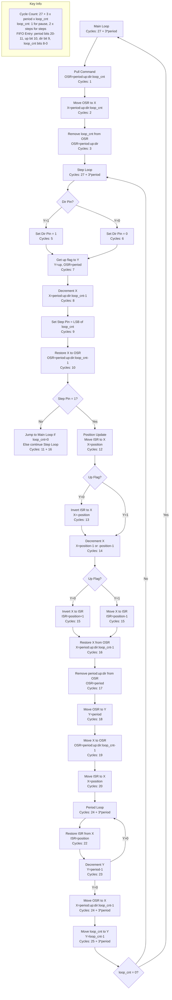

This flow is grok3 generated

```mermaid
graph TD
    A[Start: Main Loop<br>ISR=position, X=invalid, Y=invalid, OSR=invalid<br>Cycles: 0] --> B[Pull Command<br>OSR=period:up:dir:loop_cnt<br>Cycles: 1]
    B --> C[Move OSR to X<br>X=period:up:dir:loop_cnt<br>Cycles: 2]
    C --> D[Remove loop_cnt from OSR<br>OSR=period:up:dir<br>Cycles: 3]
    D --> E[Step Loop<br>Move dir to Y<br>Y=dir<br>Cycles: 4]
    E --> F{Dir Pin?}
    F -->|Y=1| G[Set Dir Pin = 1<br>Cycles: 5]
    F -->|Y=0| H[Set Dir Pin = 0<br>Cycles: 6]
    G --> I[Get up flag to Y<br>Y=up, OSR=period<br>Cycles: 7]
    H --> I
    I --> J[Decrement X<br>X=period:up:dir:loop_cnt-1<br>Cycles: 8]
    J --> K[Set Step Pin = LSB of loop_cnt<br>Cycles: 9]
    K --> L[Restore X to OSR<br>OSR=period:up:dir:loop_cnt-1<br>Cycles: 10]
    L --> M{Step Pin = 1?}
    M -->|No| N[Jump to Main Loop if loop_cnt=0<br>Else continue Step Loop<br>Cycles: 11 + 16]
    M -->|Yes| O[Position Update<br>Move ISR to X<br>X=position<br>Cycles: 12]
    O --> P{Up Flag?}
    P -->|Y=0| Q[Invert ISR to X<br>X=-position<br>Cycles: 13]
    P -->|Y=1| R[Decrement X<br>X=position-1 or -position-1<br>Cycles: 14]
    Q --> R
    R --> S{Up Flag?}
    S -->|Y=0| T[Invert X to ISR<br>ISR=position+1<br>Cycles: 15]
    S -->|Y=1| U[Move X to ISR<br>ISR=position-1<br>Cycles: 15]
    T --> V[Restore X from OSR<br>X=period:up:dir:loop_cnt-1<br>Cycles: 16]
    U --> V
    V --> W[Remove period:up:dir from OSR<br>OSR=period<br>Cycles: 17]
    W --> X[Move OSR to Y<br>Y=period<br>Cycles: 18]
    X --> Y[Move X to OSR<br>OSR=period:up:dir:loop_cnt-1<br>Cycles: 19]
    Y --> Z[Move ISR to X<br>X=position<br>Cycles: 20]
    Z --> AA[Period Loop<br>Push position to FIFO<br>ISR=0<br>Cycles: 21]
    AA --> AB[Restore ISR from X<br>ISR=position<br>Cycles: 22]
    AB --> AC[Decrement Y<br>Y=period-1<br>Cycles: 23]
    AC -->|Y>0| AA[Period Loop<br>Cycles: 24 + 3*period]
    AC -->|Y=0| AD[Move OSR to X<br>X=period:up:dir:loop_cnt-1<br>Cycles: 24 + 3*period]
    AD --> AE[Move loop_cnt to Y<br>Y=loop_cnt-1<br>Cycles: 25 + 3*period]
    AE --> AF{loop_cnt = 0?}
    AF -->|Yes| A[Main Loop<br>Cycles: 27 + 3*period]
    AF -->|No| E[Step Loop<br>Cycles: 27 + 3*period]

    subgraph Key Info
        INFO[Cycle Count: 27 + 3 x period x loop_cnt<br>loop_cnt: 1 for pause, 2 x steps for steps<br>FIFO Entry: period bits 20-11, up bit 10, dir bit 9, loop_cnt bits 8-0]
    end
```
