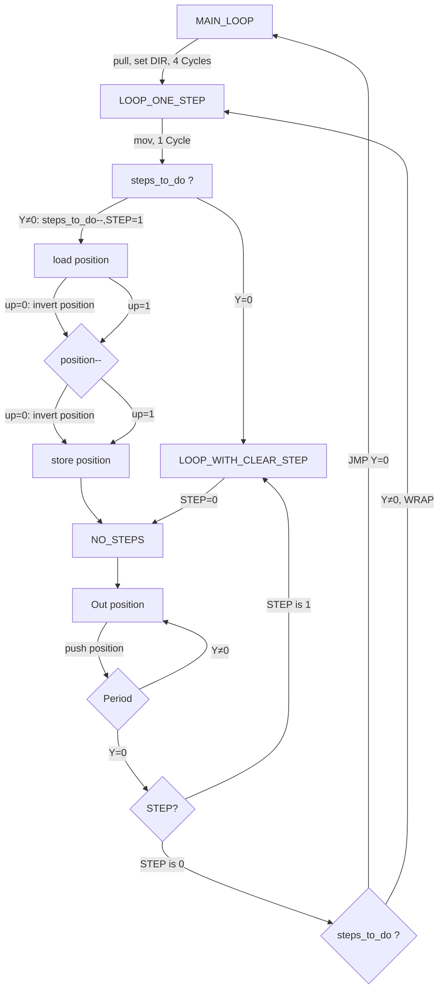

```mermaid
flowchart TD
    A[MAIN_LOOP] -->|pull, set DIR, 4 Cycles| E[LOOP_ONE_STEP]
    
    E -->|mov, 1 Cycle| G[steps_to_do ?]

    G -->|Y=0| H[LOOP_WITH_CLEAR_STEP]
    G -->|Y≠0: steps_to_do--,STEP=1| J[load position]
    J -->|up=0: invert position| O{position--}
    J -->|up=1| O
    O -->|up=0: invert position| Q[store position]
    O -->|up=1| Q
    Q --> R{jmp}
    
    H -->|STEP=0| R[NO_STEPS]
    R --> T[Out position]
    T -->|push position| U{Period}
    U -->|Y≠0| T
    U -->|Y=0| V{STEP?}
    V -->|STEP is 1| H
    V -->|STEP is 0| W{steps_to_do ?}
    W -->|JMP Y=0| A
    W -->|Y≠0, WRAP| E
```
