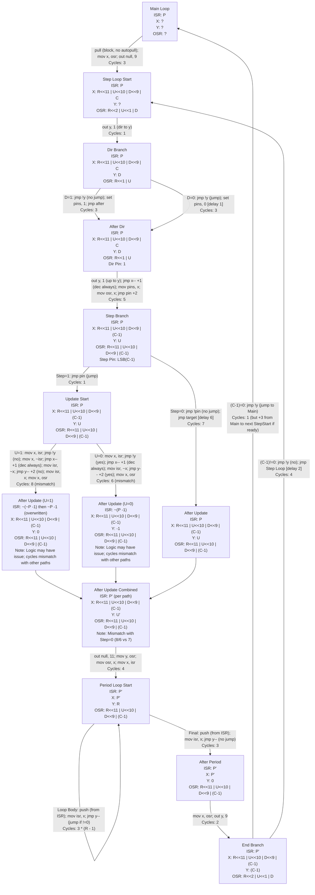

This flow is grok4 generated, after correction and guiding comments. Best result compared to claude/grok/chatGPT/copilot/gemini2.5 and all open source llms available to me like gemma3, deepseek:70b, phi4-reasoning:plus, Hunyuan T1, devstral,...

