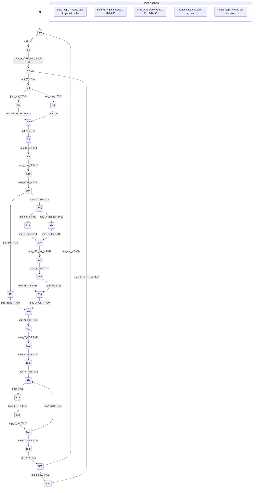

This flow is Claude generated, minor error present. but result is better than from grok/chatGPT/copilot and all open source llms available to me like gemma3, deepseek:70b, phi4-reasoning:plus,...

```mermaid
stateDiagram-v2
    [*] --> S0
    S0 --> S1: pull T=1
    S1 --> S3: mov_X_OSR_out_null_9 T=3
    S3 --> S4: out_Y_1 T=4
    S4 --> S5: jmp_not_Y T=5
    S4 --> S6: set_pins_1 T=5
    S5 --> S7: set_pins_0_delay1 T=7
    S6 --> S7: jmp T=6
    S7 --> S8: out_Y_1 T=8
    S8 --> S9: jmp_X_dec T=9
    S9 --> S10: mov_pins_X T=10
    S10 --> S11: mov_OSR_X T=11
    S11 --> S12: jmp_pin T=12
    S11 --> S19: mov_X_ISR T=12
    S12 --> S20: jmp_delay7 T=20
    S19 --> S13: jmp_not_Y T=13
    S19 --> S14: mov_X_not_ISR T=13
    S13 --> S15: jmp_X_dec T=14
    S14 --> S15: jmp_X_dec T=15
    S15 --> S16: mov_ISR_not_X T=16
    S16 --> S17: jmp_Y_dec T=17
    S17 --> S18: mov_ISR_X T=18
    S17 --> S18: continue T=18
    S18 --> S20: mov_X_OSR T=20
    S20 --> S21: out_null_11 T=21
    S21 --> S22: mov_Y_OSR T=22
    S22 --> S23: mov_OSR_X T=23
    S23 --> S24: mov_X_ISR T=24
    S24 --> S25: push T=25
    S25 --> S26: mov_ISR_X T=26
    S26 --> S27: jmp_Y_dec T=27
    S27 --> S24: loop_back T=24
    S27 --> S28: mov_X_OSR T=28
    S28 --> S29: out_Y_9 T=29
    S29 --> S0: jmp_not_Y T=30
    S29 --> S30: jmp_delay2 T=32
    S30 --> S3: wrap_to_step_loop T=3

    state "Timing Analysis" as TA {
        state "Base loop 27 cycles plus 3N period cycles" as T1
        state "Step HIGH path cycles 0-12-20-30" as T2  
        state "Step LOW path cycles 0-12-19-20-30" as T3
        state "Position update always 7 cycles" as T4
        state "Period loop 3 cycles per iteration" as T5
    }
```
