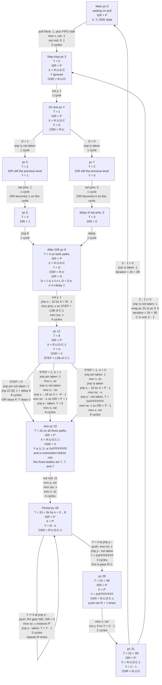

# Pico PIO program flow

[Back to README](../../README.md) | [Pico platform](platforms/pico.md)

This markdown file is grok4.7 generated.

State machine built by `stepper_make_program()` in `src/pd_pico/pico_pio.cpp`.
One FIFO word is one command. The machine peels that word, pulses the step
pin, updates the position held in the ISR, and pushes the position to the RX
FIFO while it waits out the step period.

`add_step` stores 32 instruction words. The source lists one further
instruction, `jmp step_loop [2]`, and that word is not stored. The loaded
continue edge is the wrap from pc 31 to pc 3. Wrap adds no cycle. The source
sets `wrap_at = 31` and `wrap_target = 3` (`label_step_loop`).

## Command word

OUT shifts the OSR to the right (SDK default). Low bits come out first.

```
bit 31                 11 10  9 8        0
    [ R, 21 bits      ][U][D][ C, 9 bits ]
```

| Field | Bits | Meaning |
| --- | --- | --- |
| `C` | 8:0 | Loop count. Pause: `C = 1`. Steps: `C = 2 * steps`. |
| `D` | 9 | DIR pin written with `set pins`. |
| `U` | 10 | `1` counts position up, `0` counts down. |
| `R` | 31:11 | Period. Y starts here for the wait loop. |

`pio_make_fifo_entry` builds `(R << 11) | (U << 10) | (D << 9) | C`.

After `C` is decremented, the step pin is the new LSB of `C`:

* `C` even → LSB becomes 1 → position is updated (high half of a step).
* `C` odd → LSB becomes 0 → position is left unchanged (low half, or a pause).

A step command therefore runs `2 * steps` iterations. A pause runs one
iteration and never takes the position update.

Pins, from `StepperQueue::setupSM()`:

* `mov pins` / OUT pins: the step GPIO, one pin.
* `jmp pin`: the same step GPIO.
* `set pins`: the DIR GPIO, one pin.

## Cycle rules

Each stored instruction takes one cycle, plus its delay field. `set pins, 0 [1]`
is two cycles. `jmp pc 22 [6]` is seven. A blocking `pull` with an empty TX
FIFO stalls for as long as the FIFO stays empty; the stall is outside the
counts below.

`jmp x--` and `jmp y--` test the register, then decrement it either way.
The jump is taken when the value was non-zero before the decrement. A
register that was 0 becomes `0xFFFFFFFF` and the jump is not taken. Counting
up inverts the position, decrements, and inverts again, so a decrement of 0
has to underflow. That is what turns position `0xFFFFFFFF` into 0.

## Loaded program

| pc | Instruction | Cycles | Next |
| --- | --- | --- | --- |
| 0 | `pull block` | 1 | 1. Main loop. OSR becomes the FIFO word. |
| 1 | `mov x, osr` | 1 | 2 |
| 2 | `out null, 9` | 1 | 3. Drops `C`. |
| 3 | `out y, 1` | 1 | 4. Step loop. `Y = D`. |
| 4 | `jmp !y, 7` | 1 | 7 if `D = 0`, else 5. |
| 5 | `set pins, 1` | 1 | 6. DIR = 1. |
| 6 | `jmp 8` | 1 | 8 |
| 7 | `set pins, 0 [1]` | 2 | 8. DIR = 0 on the first of these two cycles. |
| 8 | `out y, 1` | 1 | 9. `Y = U`. OSR is `R`. |
| 9 | `jmp x--, 10` | 1 | 10. `X = X - 1`. |
| 10 | `mov pins, x` | 1 | 11. STEP = LSB of `X`. |
| 11 | `mov osr, x` | 1 | 12 |
| 12 | `jmp pin, 14` | 1 | 14 if STEP is 1, else 13. |
| 13 | `jmp 22 [6]` | 7 | 22. Same length as the position update. |
| 14 | `mov x, isr` | 1 | 15 |
| 15 | `jmp !y, 17` | 1 | 17 if `U = 0`, else 16. |
| 16 | `mov x, ~isr` | 1 | 17. Count up. |
| 17 | `jmp x--, 18` | 1 | 18. `X = X - 1`, including 0 → `0xFFFFFFFF`. |
| 18 | `mov isr, ~x` | 1 | 19 |
| 19 | `jmp y--, 21` | 1 | 21 if `Y != 0`. `Y` decrements either way. |
| 20 | `mov isr, x` | 1 | 21. Count down keeps `X` rather than `~X`. |
| 21 | `mov x, osr` | 1 | 22 |
| 22 | `out null, 11` | 1 | 23. Join. OSR becomes `R`. |
| 23 | `mov y, osr` | 1 | 24. `Y = R`. |
| 24 | `mov osr, x` | 1 | 25 |
| 25 | `mov x, isr` | 1 | 26. `X = P`. |
| 26 | `push` | 1 | 27. RX FIFO gets the ISR, then the ISR is 0. |
| 27 | `mov isr, x` | 1 | 28. ISR restored. |
| 28 | `jmp y--, 26` | 1 | 26 while `Y` was non-zero. |
| 29 | `mov x, osr` | 1 | 30 |
| 30 | `out y, 9` | 1 | 31. `Y = C - 1`. |
| 31 | `jmp !y, 0` | 1 | 0 if `Y = 0`. Otherwise wrap to 3. |

The unstored source instruction would have been pc 32, `jmp 3 [2]` (3 cycles).
The patch `program.code[13] |= 22` is what makes pc 13 land on the join.

`T` in the diagram is the number of cycles since entering pc 3 on this
iteration. The comments `T=20` and `T=24` in the source are the 1-based cycle
index from `pull` on the first word: step-loop entry is cycle 4, so those
comments are `T + 4`.

## Flow

`W` means the full word `R:U:D:C`. After an OUT, the same notation is the
fields still in the OSR, with the rightmost field in the LSB. `P` is the
position in the ISR. `P'` is `P` after the optional update (`P + 1`, `P - 1`,
or `P`).


```mermaid
flowchart TD
  Main["Main pc 0<br>waiting on pull<br>ISR = P<br>X, Y, OSR stale"]
  Main -->|"pull block: 1, plus FIFO stall<br>mov x, osr: 1<br>out null, 9: 1<br>3 cycles"| Step

  Step["Step loop pc 3<br>T = 0<br>ISR = P<br>X = R:U:D:C<br>Y ignored<br>OSR = R:U:D"]
  Step -->|"out y, 1<br>1 cycle"| Dir

  Dir["Dir test pc 4<br>T = 1<br>ISR = P<br>X = R:U:D:C<br>Y = D<br>OSR = R:U"]

  Dir -->|"D = 1<br>jmp !y not taken<br>1 cycle"| DirHi
  DirHi["pc 5<br>T = 2<br>DIR still the previous level<br>Y = 1"]
  DirHi -->|"set pins, 1<br>1 cycle<br>DIR becomes 1 on this cycle"| DirHiJ
  DirHiJ["pc 6<br>T = 3<br>DIR = 1"]
  DirHiJ -->|"jmp 8<br>1 cycle"| AfterDir

  Dir -->|"D = 0<br>jmp !y taken<br>1 cycle"| DirLo
  DirLo["pc 7<br>T = 2<br>DIR still the previous level<br>Y = 0"]
  DirLo -->|"set pins, 0<br>1 cycle<br>DIR becomes 0 on this cycle"| DirLoD
  DirLoD["delay of set pins, 0<br>T = 3<br>DIR = 0"]
  DirLoD -->|"delay<br>1 cycle"| AfterDir

  AfterDir["After DIR pc 8<br>T = 4 on both paths<br>ISR = P<br>X = R:U:D:C<br>Y = D<br>OSR = R:U<br>DIR = D<br>D = 1 is 1+1+1, D = 0 is 1+1+delay 1"]

  AfterDir -->|"out y, 1<br>jmp x--, 10 so X = W - 1<br>mov pins, x so STEP = LSB of C-1<br>mov osr, x<br>4 cycles"| StepPin

  StepPin["pc 12<br>T = 8<br>ISR = P<br>X = R:U:D:C-1<br>Y = U<br>OSR = X<br>STEP = LSB of C-1"]

  StepPin -->|"STEP = 0<br>jmp pin not taken: 1<br>jmp 22 [6]: 1 + delay 6<br>8 cycles<br>ISR stays P, Y stays U"| Join

  StepPin -->|"STEP = 1, U = 1<br>jmp pin taken: 1<br>mov x, isr<br>jmp !y not taken<br>mov x, ~isr<br>jmp x--, 18 so X = ~P - 1<br>mov isr, ~x so ISR = P + 1<br>jmp y-- taken, Y = 0<br>mov x, osr<br>8 cycles"| Join

  StepPin -->|"STEP = 1, U = 0<br>jmp pin taken: 1<br>mov x, isr<br>jmp !y taken<br>jmp x--, 18 so X = P - 1<br>mov isr, ~x<br>jmp y-- not taken, Y = 0xFFFFFFFF<br>mov isr, x so ISR = P - 1<br>mov x, osr<br>8 cycles"| Join

  Join["Join pc 22<br>T = 16 on all three paths<br>ISR = P'<br>X = R:U:D:C-1<br>OSR = X<br>Y is U, 0, or 0xFFFFFFFF<br>and is overwritten before use<br>the three bodies are 7, 7, and 7"]

  Join -->|"out null, 11<br>mov y, osr<br>mov osr, x<br>mov x, isr<br>4 cycles"| Period

  Period["Period pc 26<br>T = 20 + 3k for k = 0 .. R<br>ISR = P'<br>X = P'<br>Y = R - k<br>OSR = R:U:D:C-1"]

  Period -->|"Y != 0 at jmp y--<br>push: RX gets ISR, ISR = 0<br>mov isr, x restores P'<br>jmp y-- taken, Y = Y - 1<br>3 cycles<br>repeats R times"| Period

  Period -->|"Y = 0 at jmp y--<br>push, mov isr, x<br>jmp y-- not taken<br>Y = 0xFFFFFFFF<br>3 cycles<br>this is pass R+1"| AfterPer

  AfterPer["pc 29<br>T = 23 + 3R<br>ISR = P'<br>X = P'<br>Y = 0xFFFFFFFF<br>OSR = R:U:D:C-1<br>push ran R + 1 times"]

  AfterPer -->|"mov x, osr<br>out y, 9 so Y = C - 1<br>2 cycles"| Tail

  Tail["pc 31<br>T = 25 + 3R<br>ISR = P'<br>X = R:U:D:C-1<br>Y = C - 1<br>OSR = R:U:D"]

  Tail -->|"C - 1 = 0<br>jmp !y taken: 1<br>iteration = 26 + 3R"| Main

  Tail -->|"C - 1 != 0<br>jmp !y not taken: 1<br>wrap pc 31 to pc 3: 0<br>iteration = 26 + 3R<br>C is now C - 1"| Step
```

## Parallel paths

Cycles from step-loop entry to the join:

| Path | `out y, 1` | DIR fork | pc 8–11 | `jmp pin` plus body | Arrival |
| --- | --- | --- | --- | --- | --- |
| `D = 1`, STEP = 0 | 1 | `1 + 1 + 1` = 3 | 4 | `1 + 7` = 8 | T = 16 |
| `D = 0`, STEP = 0 | 1 | `1 + 1 + delay 1` = 3 | 4 | `1 + 7` = 8 | T = 16 |
| STEP = 1, `U = 1` | 1 | 3 | 4 | `1 + 7` = 8 | T = 16 |
| STEP = 1, `U = 0` | 1 | 3 | 4 | `1 + 7` = 8 | T = 16 |

DIR changes on T = 2 in both forks. The third fork cycle is `jmp 8` when
`D = 1` and the delay of `set pins, 0` when `D = 0`.

The three position paths meet at T = 16. `Y` differs across those paths.
`mov y, osr` at T = 17 replaces it with `R` before `Y` is read again.

The exit to main and the wrap back to the step loop both spend one cycle on
`jmp !y`. The wrap adds nothing further, so both ends of an iteration are
`26 + 3R` cycles.

The unstored `jmp 3 [2]` would replace that 0-cycle wrap with 3 cycles. A
continue edge drawn from the source listing is 3 cycles longer than the edge
the chip runs, and the iteration becomes `29 + 3R`. Charging the wrap itself
one cycle is the `27 + 3R` figure in the source comment. The measured overhead
matches the loaded machine: `LOOP_OVERHEAD` is 26.

## Timing

One step-loop iteration, from pc 3 back to pc 3 or on to pc 0:

| Piece | Cycles |
| --- | --- |
| `out y, 1` and the DIR fork | 4 |
| pc 8 through the position body | 12 |
| Isolate `R`, copy it to `Y`, restore OSR and `X` | 4 |
| Period body, executed `R + 1` times | `3R + 3` |
| `mov x`, `out y, 9`, `jmp !y` | 3 |
| Wrap, only if `C - 1 != 0` | 0 |
| Total | `26 + 3R` |

`jmp y--` is why the body runs `R + 1` times. The extra pass is the `+ 3`
inside the 26. `R = 0` still pushes the position once.

Once per FIFO word, before the first step-loop entry, the machine runs
`pull`, `mov x, osr`, and `out null, 9` (3 cycles, plus any pull stall).
With the next word already waiting, the time from one `pull` to the next is

```
3 + loop_cnt * (26 + 3R)
```

`pio_calc_loops` budgets `loop_cnt * (26 + 3R)` and leaves those 3 cycles
outside the budget. Step commands all go through that function.

`LOOPS_FOR_1US` is `(80 - 27) / 3`, which is 17. It is used only in
`StepperQueue::getCurrentStepCount()`, and only when the state machine is
idle. The call queues one pause (`steps = 0`, so `C = 1`) to make the program
push the position already held in the ISR. `getCurrentPosition()` and the idle
`pos_offset` capture in `add_queue_entry` reach it through that function. The
pause length does not change the position word. At 80 MHz that one-iteration
pause is `3 + 26 + 3 * 17` = 80 cycles, which is 1 µs. `(80 - 3 - 26) / 3` is
the same 17, so the constant stays.
